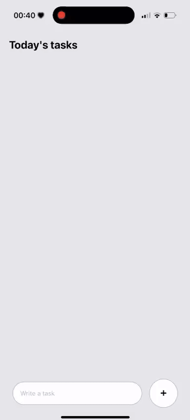

# 🌙 𝑴𝒐𝒓𝒓𝒐𝒘 — 𝑻𝒐-𝑫𝒐 𝑨𝒑𝒑

**Morrow** (*“to-morrow-do”*) is a minimal and polished to-do app built with **React Native + Expo**.

---

## ✨ Features

* 📝 **Tap to edit** — quick modal input for renaming a task
* ✅ **Swipe right to complete** — reveals a green “Complete” action
* 🎬 **Animated removal** — row gracefully fades & slides **up** before disappearing
* ↩️ **Undo snackbar** — animated banner to restore accidentally completed tasks
* 📱 **Smooth list collapsing** with `LayoutAnimation` (Android supported)
* ♿ **Accessible touch targets & hints** for better usability

---

## 🛠 Tech Stack

* **React Native (Expo)**
* **react-native-gesture-handler** for swipe gestures
* **Animated API** + **LayoutAnimation** for smooth transitions

---

## 📂 Project Structure

```
.
├─ App.js                 # Main screen: list, swipe/animations, edit modal, undo
└─ components/
   └─ Task.js             # Task row component (UI + interaction)
```

---

## 🚀 Getting Started

### 1. Install dependencies

With **Expo (recommended):**

```bash
npm install
npx expo install react-native-gesture-handler
```

> `expo install` ensures compatibility with your Expo SDK.

If using bare React Native (after ejecting):

```bash
npm install
npm i react-native-gesture-handler
npx pod-install   # iOS only
```

---

### 2. Run the app

```bash
npx expo start
```

* Press **a** → Android emulator (if running)
* Press **i** → iOS simulator (macOS)
* Or scan the QR code in **Expo Go** (Android/iOS)

Clear cache if needed:

```bash
npx expo start -c
```

---

## 🎮 Usage

* ➕ **Add task** — type in the field, press **Enter** or tap **+**
* ✏️ **Edit task** — tap a row
* ✅ **Complete task** — swipe right to reveal “Complete”, release to trigger
* ↩️ **Undo** — tap **UNDO** in the snackbar (appears for ~4s)
___

